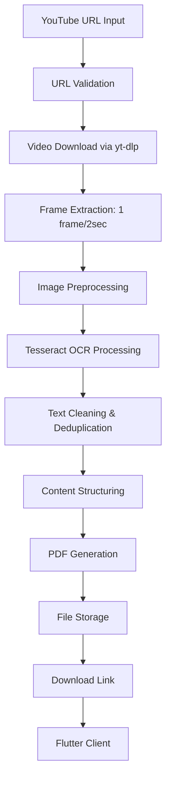

# FruitNotes 🎓📹→📝

**Automated YouTube Video to PDF Notes Converter**

VisionNotes is an intelligent Flutter application that transforms educational YouTube videos into structured PDF notes by analyzing visual content. Perfect for students, researchers, and lifelong learners.

## 🚀 Features

- **Smart Frame Capture** - Analyzes video content at optimal intervals
- **Advanced OCR Processing** - Accurate text extraction using Tesseract
- **Intelligent Text Processing** - Deduplication, UI filtering, and content structuring
- **Instant PDF Generation** - Professional, formatted notes
- **100% Free & Open Source** - No subscriptions, entirely free technologies
- **Cross-Platform** - Flutter-based mobile application

## 🏗️ System Architecture

### High-Level Flow
```
┌─────────────────────┐    HTTP REST API    ┌───────────────────────────────────┐
│   FLUTTER CLIENT    │ ◄─────────────────► │    PYTHON BACKEND SERVER          │
│                     │                     │                                   │
│ • UI Interface      │                     │ • API Gateway (Flask)             │
│ • State Management  │                     │ • Processing Pipeline             │
│ • PDF Viewer        │                     │ • Temporary Storage               │
└─────────────────────┘                     └───────────────────────────────────┘
```

### Processing Pipeline


## 🛠️ Technical Stack

### Frontend (Flutter)
```
lib/
├── models/
│   ├── job_model.dart      # Job status tracking
│   └── pdf_model.dart      # PDF metadata
├── services/
│   ├── api_service.dart    # HTTP client for backend
│   └── cache_service.dart  # Local file caching
├── widgets/
│   ├── url_input.dart      # URL submission form
│   ├── progress_indicator.dart # Processing status
│   └── pdf_viewer.dart     # PDF display & download
└── utils/
    ├── constants.dart      # API endpoints
    └── file_handler.dart   # File system operations
```

### Backend (Python Flask)
```
backend/
├── app.py                 # Flask application entry
├── routes/
│   └── api_routes.py      # REST endpoint definitions
├── services/
│   ├── video_service.py   # YouTube download handler
│   ├── frame_service.py   # OpenCV frame processing
│   ├── ocr_service.py     # Tesseract text extraction
│   ├── text_service.py    # Text processing logic
│   └── pdf_service.py     # ReportLab PDF generation
├── utils/
│   ├── file_cleaner.py    # Temporary file management
│   └── config.py          # Application configuration
└── temp/                  # Temporary file storage
    ├── downloads/         # Video files
    ├── frames/           # Extracted images
    └── pdfs/             # Generated PDFs
```

## 📡 API Documentation

### Endpoints

| Method | Endpoint | Description |
|--------|----------|-------------|
| `POST` | `/api/process-video` | Submit YouTube URL for processing |
| `GET` | `/api/job-status/{job_id}` | Check processing status |
| `GET` | `/api/download/{job_id}` | Download generated PDF |

### Request Flow
```
User          Flutter          Backend          Processing
  |              |                |                 |
  |-- Enter URL->|                |                 |
  |              |-- POST /process -->|             |
  |              |                |-- Download Video| 
  |              |                |-- Extract Frames|
  |              |                |-- OCR Processing|
  |              |                |-- Text Cleaning |
  |              |                |-- Generate PDF  |
  |              |<-- Job ID -----|                 |
  |              |-- GET /status ->|                 |
  |              |<-- Completed ---|                 |
  |              |-- GET /download ->               |
  |              |<--- PDF File ---|                 |
  |<-- Display PDF|                |                 |
```

## ⚙️ Configuration

### Frame Extraction Settings
| Parameter | Value | Description |
|-----------|-------|-------------|
| Frame Interval | 2 seconds | Balance between coverage & performance |
| Image Quality | 480p | Minimum resolution for OCR |
| Processing Batch | 10 frames | Memory management optimization |
| Timeout | 10 minutes | Maximum processing time |

### Text Processing Pipeline
| Stage | Input | Output |
|-------|-------|--------|
| Raw OCR | Image frames | Text chunks |
| Deduplication | Text chunks | Unique content |
| UI Filtering | Unique content | Clean text |
| Structure Detection | Clean text | Headers & body content |
| PDF Assembly | Structured text | Formatted PDF |

## 🔧 Installation

### Prerequisites
- Flutter SDK 3.0+
- Python 3.8+
- Tesseract OCR
- FFmpeg

### Backend Setup
```bash
cd backend
pip install -r requirements.txt
python app.py
```

### Frontend Setup
```bash
cd frontend
flutter pub get
flutter run
```

## 📊 Performance

### Processing Timeline (5-minute video)
| Phase | Time | Resource Usage |
|-------|------|----------------|
| Video Download | 30s | Network I/O |
| Frame Extraction | 15s | CPU Intensive |
| OCR Processing | 45s | CPU/Memory |
| Text Processing | 10s | Memory |
| PDF Generation | 20s | CPU |
| **Total** | **~2 min** | **Moderate** |

## 🐛 Error Handling

```
Start Processing
        ↓
┌─────────────────┐
│ Validate URL    │ → Invalid → Error 400
└─────────────────┘
        ↓
┌─────────────────┐
│ Download Video  │ → Failed → Error 502
└─────────────────┘
        ↓
┌─────────────────┐
│ Extract Frames  │ → Empty → Error 503
└─────────────────┘
        ↓
┌─────────────────┐
│ OCR Processing  │ → No Text → Error 504
└─────────────────┘
        ↓
┌─────────────────┐
│ Generate PDF    │ → Failed → Error 505
└─────────────────┘
        ↓
Success → Return PDF
```

## 🚀 Deployment

### Free Hosting Options
- **Backend**: Render, Heroku, PythonAnywhere
- **File Storage**: Cloudinary (free tier)
- **CDN**: GitHub Pages for static assets

## 🤝 Contributing

We welcome contributions! Please see our [Contributing Guidelines](CONTRIBUTING.md) for details.

## 📄 License

This project is licensed under the MIT License - see the [LICENSE](LICENSE) file for details.

## 🆘 Support

- 📧 **Issues**: [GitHub Issues](https://github.com/yourusername/visionnotes/issues)
- 💬 **Discussions**: [GitHub Discussions](https://github.com/yourusername/visionnotes/discussions)
- 📚 **Documentation**: [Wiki](https://github.com/yourusername/visionnotes/wiki)

---

**🎓 Transform Video Content into Knowledge Assets with VisionNotes!**
